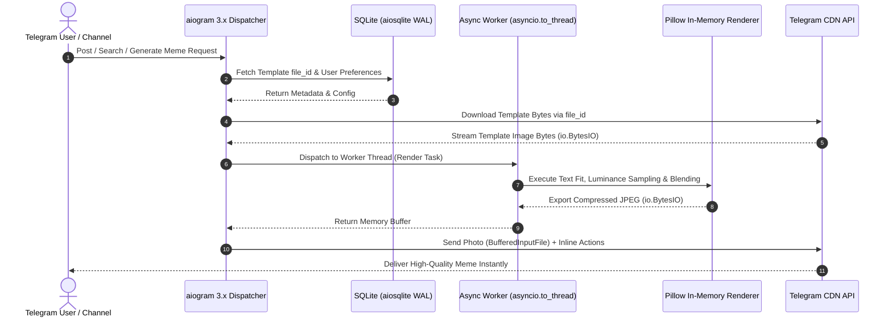

# KBKH Meme Engine

[](https://www.python.org/)
[](https://docs.aiogram.dev/)
[](https://pillow.readthedocs.io/)
[](https://www.sqlite.org/wal.html)
[](https://railway.app/)
[](LICENSE)

An enterprise-grade, high-concurrency Telegram meme generation engine engineered for performance, dynamic script rendering, and intelligent visual branding. Designed from the ground up with **zero-disk storage**, **asynchronous non-blocking worker pools**, and **smart contrast-aware asset placement**, the engine serves bilingual (Bengali & English) communities at scale.

---

## ⚡ Executive Overview

Modern Telegram bots that handle continuous media generation often suffer from disk I/O bottlenecks, high memory consumption, font rendering artifacts, and ungraceful concurrency stalls.

**KBKH Meme Engine** addresses these challenges via:
- **Zero-Disk Media Persistence**: Images and templates are streamed strictly through memory buffers (`io.BytesIO`) using Telegram CDN `file_id` references, eliminating persistent disk churn.
- **Smart Luminance Branding**: Calculates ITU-R BT.601 perceived luminance at runtime to automatically pick between dark and light brand logos.
- **Dynamic Relative Geometry**: Auto-wraps and dynamically fits multi-line typography within proportional bounding boxes ($0.045W - 0.06W$) across varied aspect ratios.
- **Bilingual Multi-Script Typography**: Built-in curated suite of 17 verified Unicode fonts (10 Bengali and 7 English) with automated script detection and fallback guards.
- **Strict Opt-In Banner Infrastructure**: Bannerless by default; promotional bottom extensions are attached on user demand without altering base templates.
- **Dual-Export & Raw Dispatch**: Instant in-memory switching between branded, clean (unbranded), and uncompressed source template deliveries.

---

## 🏗️ System Architecture & Data Flow



---

## 🏛️ Core Architectural Pillars

### 1. Zero-Disk Storage Pipeline
Traditional bots download image assets to temporary folders on disk, leading to inode exhaustion, race conditions in multi-threaded workflows, and privacy leakage.
- **In-Memory Buffering**: Every operation—fetching template bytes, resizing, typography composition, logo overlay, and JPEG encoding—executes inside Python `io.BytesIO` streams.
- **Telegram CDN Anchoring**: Templates and banners are recorded exclusively by their persistent Telegram `file_id`. The local database stores lightweight relational records and search vectors.

### 2. Smart Luminance Branding
Brand logos must remain legible across any background image without manual operator intervention:
- **Sample Region**: Top-right canvas bounding box $[W - \text{margin} - W_{\text{logo}}, \text{margin}, W - \text{margin}, \text{margin} + H_{\text{logo}}]$.
- **Perceived Luminance Formula (ITU-R BT.601)**:
  $$L = 0.299 \cdot R + 0.587 \cdot G + 0.114 \cdot B$$
- **Automatic Asset Switching**:
  - If $L < 128$: Canvas background is dark $\rightarrow$ dynamically selects `kbkh_white.png`.
  - If $L \ge 128$: Canvas background is bright $\rightarrow$ dynamically selects `kbkh_black.png`.
- **Alpha Blending**: Logos are composited with an 80% alpha mask ($A = \text{int}(p \cdot 0.80)$) using high-precision Lanczos resampling.

### 3. Dynamic Relative Geometry
Text scaling and positioning adapt smoothly to arbitrary canvas dimensions:
- **Proportional Scaling**: Initial font sizes are calculated as $W \cdot 0.055$ (clamped between 24px and 96px) with adaptive padding ($W \cdot 0.025$).
- **Iterative Decrement Engine**: An auto-shrinking bounding loop calculates `multiline_textbbox`, decrementing font sizes dynamically by 2pt steps until text fits within boundary limits ($H \cdot 0.45$ for headers; $H \cdot 0.28$ for overlays).
- **Script-Aware Token Wrapping**: Handles complex Bengali conjoints and English word breaks gracefully without breaking glyph structures.

### 4. Multi-Script Typography Engine
Equipped with 17 verified Unicode TrueType fonts, systematically purged of legacy ANSI/non-standard encodings:

| Script | Font Name | Canonical File | Ideal Meme Style |
| :--- | :--- | :--- | :--- |
| **Bengali** | **Hind Siliguri (Bold)** *(Default)* | `HindSiliguri-Bold.ttf` | High-impact modern memes |
| Bengali | Kalpurush | `kalpurush.ttf` | Traditional clean typography |
| Bengali | Anek Bangla (ExtraBold) | `Anek Bangla ExtraBold.ttf` | Heavy headline expressions |
| Bengali | Anek Bangla (Condensed) | `Anek Bangla Condensed Bold.ttf` | Long sentences & tight headers |
| Bengali | Headline Bangla | `Headline Bangla Regular Unicode.ttf` | Bold narrative statements |
| Bengali | Li Ador Noirrit (Italic) | `Li Ador Noirrit A-V2 Italic.ttf` | Stylized emotional punches |
| Bengali | Li Saboj Charulota | `Li-Saboj Charulota Unicode Medium.ttf` | Expressive artistic captions |
| Bengali | Li Shamim Cholontika | `LiShamimCholontikaUnicode-Regular.ttf` | Casual contemporary dialog |
| Bengali | Lima Bosonto Borno | `Lima Bosonto Borno Encoding.ttf` | Distinctive decorative flair |
| Bengali | Noto Sans Bengali (Thin) | `Noto_Sans_Bengali-Thin.ttf` | Subtle commentary captions |
| **English** | **Impact (Classic Meme)** *(Default)* | `Impact.ttf` | Vintage top/bottom viral memes |
| English | Anton (Bold Impact) | `Anton-Regular.ttf` | Punchy bold social headers |
| English | Poppins (Bold) | `Poppins-Bold.ttf` | Modern minimal geometric style |
| English | Inter (Bold) | `Inter-Bold.ttf` | Neutral, high-readability layout |
| English | Bebas Neue | `BebasNeue-Regular.ttf` | All-caps cinematic impact |
| English | Oswald (Bold) | `Oswald-Bold.ttf` | Tall condensed emphasis |
| English | Montserrat (Bold) | `Montserrat-Bold.ttf` | Clean corporate & tech satire |

- **Automatic Script Detection**: Regex ranges (`\u0980`–`\u09FF`) automatically identify Bengali input and route to Bengali typography defaults.
- **Fail-Safe Fallbacks**: If an unrecognized font key is submitted, the engine seamlessly routes to `HindSiliguri-Bold.ttf` or `Impact.ttf`.

### 5. 3 Output Variants
Users can instantly toggle between three distinct layouts:
- **Variant A (White Header)**: Clean white canvas prepended above the template with auto-wrapped black text; standard modern Twitter/Reddit format.
- **Variant B (Dark Header `#1A1A1A`)**: Sleek dark mode header with crisp white text; ideal for dark-themed templates and night feeds.
- **Variant C (Classic Overlay)**: Traditional top/bottom text rendered directly onto the template with thick black outlines (`stroke_width`) and pure white fill. Use `|` delimiter to split top and bottom lines.

### 6. Opt-In Banner System
- Memes are generated **bannerless by default**.
- Operators can upload promotional sponsor banners via admin commands.
- Users can selectively attach banners via `[➕ Add Banner]` and remove them via `[✖️ Remove Banner]`.
- Banners dynamically scale to match canvas width ($W_{\text{banner}} = W_{\text{canvas}}$) and smoothly extend the canvas downward.

### 7. Dual-Export & Raw Dispatch
- **Clean Export (`[📥 Download Clean]`)**: Instantly re-renders the meme without the KBKH brand watermark for personal use.
- **Raw Template Delivery (`[📥 টেমপ্লেট ডাউনলোড]`)**: Dispatches the untouched source template image directly, both as a compressed preview and as an uncompressed Telegram Document.

---

## 📂 Repository Directory Tree

```
kbkh-meme-engine/
├── .env.example              # Self-documenting environment variable template
├── .gitignore                # Production-grade git isolation manifest
├── LICENSE                   # Open-source MIT License (2026 KBKH Group)
├── Procfile                  # Railway / PaaS process declaration
├── README.md                 # Exhaustive architectural documentation
├── bot.py                    # Application entrypoint & dispatcher orchestration
├── config.py                 # Centralized environment & asset validation
├── requirements.txt          # Production Python dependencies
├── assets/
│   ├── fonts/                # 17 verified Unicode TrueType font binaries
│   │   ├── HindSiliguri-Bold.ttf
│   │   ├── Impact.ttf
│   │   └── ...
│   └── logos/                # Brand identity assets
│       ├── kbkh_white.png
│       └── kbkh_black.png
├── database/
│   ├── __init__.py
│   ├── db.py                 # Asynchronous SQLite connection pool & WAL init
│   └── queries.py            # Async CRUD queries (templates, users, banners)
├── handlers/
│   ├── __init__.py
│   ├── admin.py              # Channel listener, banner management, stats
│   ├── meme_flow.py          # Interactive FSM generation & variant switching
│   ├── search_flow.py        # Token search & template discovery carousel
│   ├── settings.py           # Typography & custom watermark settings
│   └── start.py              # Onboarding, /help, and main menu routing
├── services/
│   ├── __init__.py
│   ├── font_manager.py       # Typography scanner, script detector & resolver
│   ├── renderer.py           # In-memory Pillow graphics compositor
│   └── search_engine.py      # Weighted token similarity & ranking logic
└── tests/
    ├── __init__.py
    ├── test_database.py      # Isolated database lifecycle & query tests
    ├── test_font_manager.py  # Typography discovery & fallback tests
    ├── test_renderer.py      # In-memory canvas, luminance & variant tests
    └── test_search_engine.py # Search normalization & fuzzy token tests
```

---

## 🚀 Local Setup & Development Guide

### Prerequisites
- **Python 3.11+** installed on your workstation.
- A Telegram Bot Token from [@BotFather](https://t.me/BotFather).
- Your Telegram User ID from [@userinfobot](https://t.me/userinfobot) (for admin privileges).

### Step 1: Clone the Repository
```bash
git clone https://github.com/<YOUR-USERNAME>/kbkh-meme-engine.git
cd kbkh-meme-engine
```

### Step 2: Configure Virtual Environment
```bash
# On Linux / macOS:
python3 -m venv venv
source venv/bin/activate

# On Windows (PowerShell):
python -m venv venv
.\venv\Scripts\Activate.ps1
```

### Step 3: Install Dependencies
```bash
pip install --upgrade pip
pip install -r requirements.txt
```

### Step 4: Environment Configuration
Copy the sanitized environment template and populate your credentials:
```bash
cp .env.example .env
```
Edit `.env`:
```env
BOT_TOKEN=123456789:ABCdefGHIjklMNOpqrSTUvwxYZ
ADMIN_IDS=123456789,987654321
DB_PATH=data/bot.db
```

### Step 5: Run Automated Verification Suite
Execute the built-in test suite to verify database schemas, typography loaders, luminance mathematics, and in-memory rendering:
```bash
python -m unittest discover tests
```

### Step 6: Start the Engine
```bash
python bot.py
```

---

## ☁️ Production Deployment on Railway

The engine is engineered for 100% turnkey deployment on [Railway](https://railway.app/).

### 1. Push to GitHub
Ensure your repository is pushed to your personal or organization GitHub account.

### 2. Create Railway Project
1. Log in to [Railway](https://railway.app/) and click **"New Project"**.
2. Select **"Deploy from GitHub repo"** and select `kbkh-meme-engine`.
3. Railway will automatically detect the `Procfile` (`worker: python bot.py`) and select the Python buildpack.

### 3. Attach Persistent Volume (Crucial for SQLite)
Since cloud containers feature ephemeral filesystems, attach a Persistent Storage Volume for SQLite:
1. In your Railway service dashboard, navigate to **Settings** $\rightarrow$ **Volumes**.
2. Click **"Add Volume"**.
3. Set the Mount Path to `/data`.

### 4. Configure Environment Variables
Navigate to the **Variables** tab on Railway and configure:

| Variable | Value | Notes |
| :--- | :--- | :--- |
| `BOT_TOKEN` | `<YOUR_TELEGRAM_BOT_TOKEN>` | Acquired from @BotFather |
| `ADMIN_IDS` | `123456789,987654321` | Comma-separated admin IDs |
| `DB_PATH` | `/data/bot.db` | Points to the attached volume mount |

### 5. Deploy & Verify
Railway will trigger an automated build and launch the bot worker. Inspect the **Deploy Logs** to confirm:
```
✓ SQLite database and schema initialized successfully.
✓ KBKH brand logo assets verified.
✓ Bot started successfully as @YourBotUsername
Starting long-polling event loop...
```

---

## 🛠️ Administrative & Channel Operations

- **Channel Template Ingestion**: Add the bot as an Administrator with *Post Messages* permission to your meme resource channel. Post any photo with a title and hashtags (e.g. `Akshay Kumar Confused #meme #akshay`). The bot automatically records the template without saving any media locally.
- **Promotional Banners**: Send `/admin` in private chat to upload promotional banners or inspect global usage analytics.
- **Search Aliases**: Admins can map colloquial search phrases to canonical template titles via database alias queries or admin commands.

---

## 🧪 Automated Testing & Quality Assurance

The codebase includes an isolated test suite requiring zero external mock servers:
```bash
# Run all tests using Python standard library
python -m unittest discover tests

# Or run with pytest (if installed in virtual environment)
pytest tests/
```

- `tests/test_renderer.py`: Validates luminance calculations, line wrapping, canvas stitching, and memory buffer exports.
- `tests/test_font_manager.py`: Verifies font dictionary integrity, script detection, and fallback resolution.
- `tests/test_database.py`: Tests SQLite table schemas, WAL mode activation, and async CRUD methods using temporary databases.
- `tests/test_search_engine.py`: Tests query normalization, token similarity ratios, and trending boost calculations.

---

## 📄 License & Attribution

Distributed under the **MIT License**. See [`LICENSE`](LICENSE) for complete terms.

```
Copyright (c) 2026 KBKH Group
```
